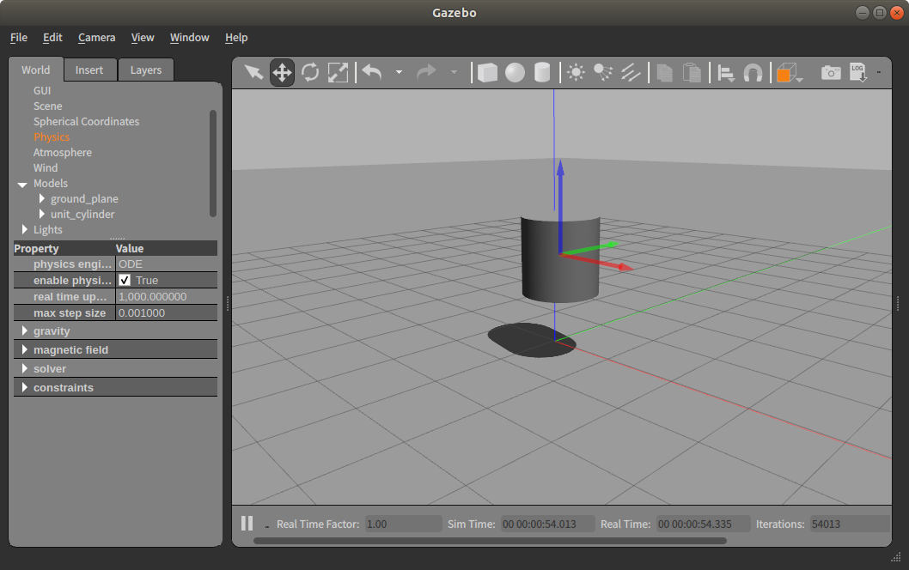

# 무중력 world plugin 구현

## 목표
- gazebo api 사용 및 world property 값 적용

## Gazebo GUI로 무중력 world 만들기

- 결과 


- Gazebo 실행
```
> gazebo
```
- gravity 값 바꾸기 
    - World tap > Physics > gravity   


----

## 코드로 무중력 world 구현하기 
- [Gazebo World Class API 참조](https://osrf-distributions.s3.amazonaws.com/gazebo/api/dev/classgazebo_1_1physics_1_1World.html#details)
- [Vector3d](hhttps://osrf-distributions.s3.amazonaws.com/ign-math/api/1.0.0/namespaceignition_1_1math.html#ab83a49e267aac56fb5c8d958c964c026)
- Load 함수 
    - setGravity()

## 디렉토리 생성 
```bash
> cd ~/projects/zero_gravity
```    
## Todo 구현하기 
- zero_gravity.cpp
- CMakeLists.txt  

## build 방법 
```bash
> cd build
> cmake ..
> make
```
## 환경변수 설정
```bash
> export GAZEBO_PLUGIN_PATH=$HOME/projects/zero_gravity/build:$GAZEBO_PLUGIN_PATH 
```

## 실행 
```bash
> gazebo ./gravity.world
```
