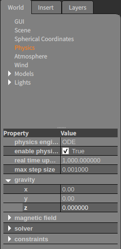

# 무중력 world plugin 구현

## Gazebo GUI로 무중력 world 만들기
- Gazebo 실행
```
> gazebo
```
- gravity 값 바꾸기 
    - World tap > Physics > gravity   


## 구현
- [Gazebo World Class API 참조](https://osrf-distributions.s3.amazonaws.com/gazebo/api/dev/classgazebo_1_1physics_1_1World.html#details)
- Load 함수 
    - setGravity()

## build 방법 
- build 디렉토리 생성
```bash
> cd ~/projects/Gazebo_Practice/2.zero_gravity_world_plugin
> mkdir build 
```    
- Plugin 빌드
```bash
> cd build
> cmake ..
> make
```
## 환경변수 설정
```bash
> export LD_LIBRARY_PATH=${LD_LIBRARY_PATH}:${PX4_Simulation}/demo/velodyne_plugin/build
```
## 실행 
```bash
> gazebo --verbose ../gravity.world
```

## 테스트
- cylider model 삽입 하여 z축 값 바꿔보기 
