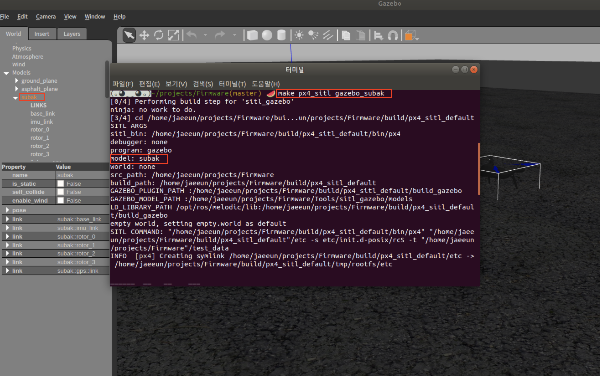

# Subak Quad만들기

## 목표
Custom 비행체가 있는 경우 PX4 SITL에 추가하여 사용하기


## 결과 
```bash
> make px4_sitl gazebo_subak
```


## Subak Model 추가하기 
- 위치 : Firmware/Tools/models
- 수정 :
  - solo 디렉터리 복사하여 subak으로 변경 
  
## Airframe 추가 
- 위치 : Firmware/ROMFS/px4fmu_common/init.d-posix/airframes
- 추가 :
  - 1014_solo 파일 --> 1014_solo로 변경
  - CMakeLists.txt --> 1014_solo 추가
  
## Build target 추가 
- 위치 : Firmware/platforms/posix/cmake/sitl_target.cmake
- 수정 : 
  - subak 추가 
