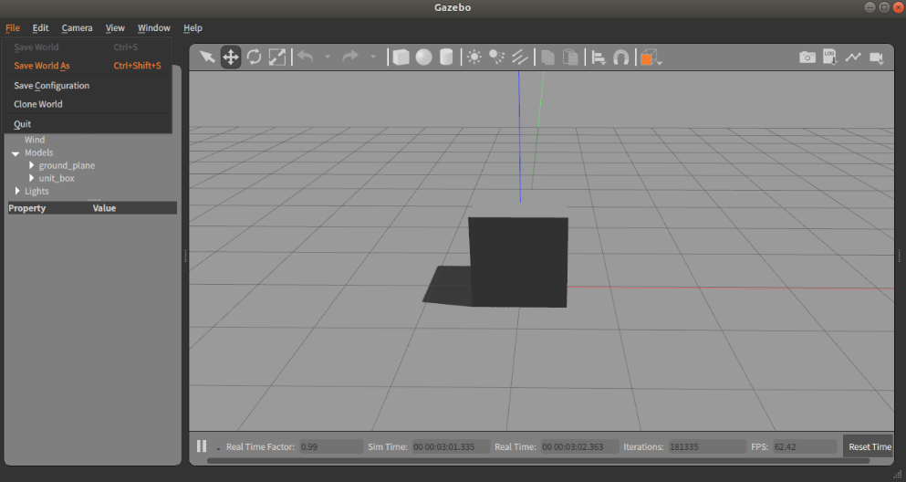
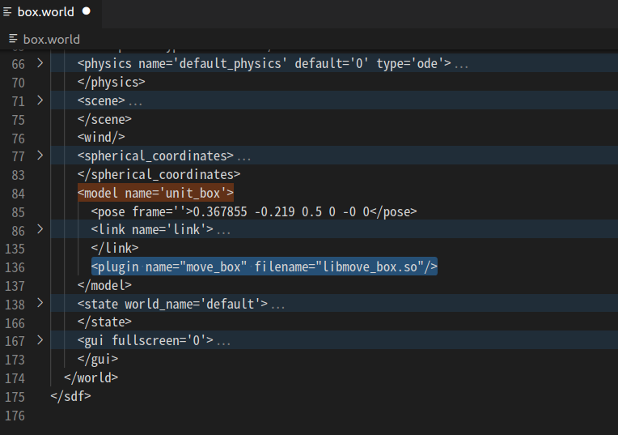

# Move Box Plugin

## 목표 
- Model Plugin 구현 및 빌드 방법 익히기
- Message Publish를 통한 model 제어 구현

## build 방법 
  ```bash
   > mkdir ~/project/moveBox
   > cd ~/project/moveBox
  ```
- CMakeLists.txt 생성 
```bash
cmake_minimum_required(VERSION 2.8 FATAL_ERROR)

find_package(gazebo REQUIRED)
include_directories(${GAZEBO_INCLUDE_DIRS})
link_directories(${GAZEBO_LIBRARY_DIRS})
list(APPEND CMAKE_CXX_FLAGS "${GAZEBO_CXX_FLAGS}")

add_library(move_box SHARED move_box.cpp)
target_link_libraries(move_box ${GAZEBO_LIBRARIES})
```
- build 디렉토리 생성
  ```bash
  > cd ~/project/moveBox/
  > mkdir build
  ```
- build 
  ```bash
  > cd build
  > cmake ..
  > make
  ```
- Plugin Path 추가 
  ```bash
  > export GAZEBO_PLUGIN_PATH=$HOME/project/moveBox/build:$GAZEBO_PLUGIN_PATH
  ```
## box world 생성하기 

- Gazebo 실행
  ```bash
    > gazebo 
  ```
- Box link 추가 
- box.world 형태로 저장 
  - 저장 위치 : ~/project/moveBox/
  

## world 파일에 플러그인 추가하기 

- VSC로 box.world 열기 
  ```bash
   > cd ~/project/moveBox/
   > code ./box.world
  ```
- model element 내에 plugin 추가
  - model name ='unit_box'
  - 추가 sdf :
  ```xml
   <plugin name="move_box" filename="libmove_box.so"/>
  ```
  

## box world 실행 
  ```bash
  > cd  ~/project/moveBox/
  > gazebo ./box.world
  ```


