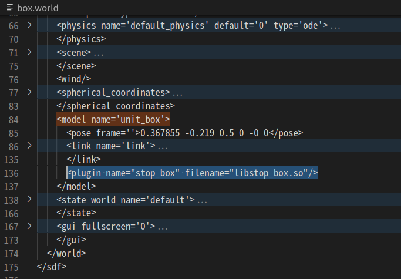

# Stop Box Plugin
- Message Publish를 통한 box(link) 제어 구현

## move_box 디렉토리 생성 
```bash
 > mkdir ~/project/moveBox
 > cd ~/project/moveBox
  ```
- [CMakeLists.txt](./CMakeLists.txt)
  - 주석 부분 수정
- [stop_box.cpp](./stop_box.cpp)
- [stop.cpp](./stop.cpp)

## 빌드 방법 
- build 디렉토리 생성
  ```bash
  > cd ~/project/moveBox/
  > mkdir build
  ```
- 빌드 
  ```bash
  > cd build
  > cmake ..
  > make
  ```
## Plugin path 추가 
  ```bash
  > export GAZEBO_PLUGIN_PATH=$HOME/project/moveBox/build:$GAZEBO_PLUGIN_PATH
  ```
## box world 생성하기 

- Gazebo 실행
  ```bash
    > gazebo 
  ```
- Box link 추가 
- box.world 형태로 저장 
  - 저장 위치 : ~/project/moveBox/
  

## world 파일에 플러그인 추가하기 

- VSC로 box.world 열기 
  ```bash
   > cd ~/project/moveBox/
   > code ./box.world
  ```
- model element 내에 plugin 추가
  - model name ='unit_box'
  - 추가 sdf :
  ```xml
   <plugin name="stop_box" filename="libstop_box.so"/>
  ```
  

## box world 실행 
  ```bash
  > cd  ~/project/moveBox/
  > gazebo ./stop.world
  ```
## stop 실행
 ```bash
 > cd ~/project/moveBox/build
 > ./stop 5
 ```
